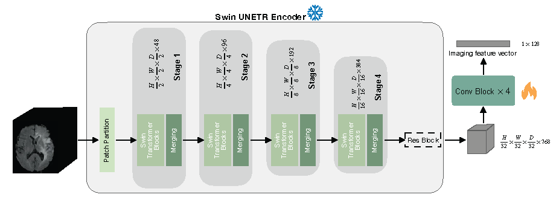

# AI-based differential diagnosis of dementia etiologies on multimodal data

This work is published in _Nature Medicine_ (https://doi.org/10.1038/s41591-024-03118-z).

## Introduction

This repository contains the implementation of a deep learning framework for the differential diagnosis of dementia etiologies using multi-modal data. 
Using data from $9$ distinct cohorts totalling $51,269$ participants, we developed an algorithmic framework, utilizing transformers and self-supervised learning, to execute differential diagnoses of dementia. This model classifies individuals into one or more of thirteen meticulously curated diagnostic categories, each aligning closely with real-world clinical requirements. These categories span the entire spectrum of cognitive conditions, from normal cognition (NC), mild cognitive impairment (MCI) to dementia (DE), and further include $10$ dementia types.


**Figure 1: Data, model architecture, and modeling strategy.** (a) Our model for differential dementia diagnosis was developed using diverse
data modalities, including individual-level demographics, health history, neurological testing, physical/neurological exams, and multi-sequence
MRI scans. These data sources whenever available were aggregated from nine independent cohorts: 4RTNI, ADNI, AIBL, FHS, LBDSU, NACC,
NIFD, OASIS, and PPMI. For model training, we merged data from NACC, AIBL, PPMI, NIFD, LBDSU, OASIS and 4RTNI.
We employed a subset of the NACC dataset for internal testing. For external validation, we utilized the ADNI and FHS cohorts. (b) A transformer
served as the scaffold for the model. Each feature was processed into a fixed-length vector using a modality-specific embedding strategy and fed
into the transformer as input. A linear layer was used to connect the transformer with the output prediction layer. (c) A distinct portion of the
NACC dataset was randomly selected to enable a comparative analysis of the model’s performance against practicing neurologists. Furthermore,
we conducted a direct comparison between the model and a team of practicing neuroradiologists using a random sample of cases with confirmed
dementia from the NACC testing cohort. For both these evaluations, the model and clinicians had access to the same set of multimodal data. Finally,
we assessed the model’s predictions by comparing them with pathology grades available from the NACC, ADNI, and FHS cohorts.


## Prerequisites

To setup the <code>adrd</code> package, run the following in the root of the repository:

```bash
pip install git+https://github.com/vkola-lab/nmed2024.git
```

The tool was developed using the following dependencies:

1. Python (3.11.7 or greater)
1. PyTorch (2.1 or greater).
2. TorchIO (0.15 or greater).
3. MONAI (1.1 or greater).
4. NumPy (1.24 or greater).
5. tqdm (4.62 or greater).
6. pandas (1.5.3 or greater).
7. nibabel (5.0 or greater).
9. matplotlib (3.7.2 or greater).
10. shap (0.43 or greater).
11. scikit-learn (1.2.2 or greater).
12. scipy (1.10 or greater).

## Installation

You can clone this repository using the following command:

```bash
git clone https://github.com/vkola-lab/nmed2024.git
```

## Training

The training process consists of two stages:

### 1. Imaging feature extraction

All code related to training the imaging model with self-supervised learning is under <code>./dev/ssl_mri/</code>.

*Note: we used skull stripped MRIs to get our image embeddings. We have provided the script for skull stripping using the publicly available SynthStrip tool* [2]. *The code is provided under <code>dev/skullstrip.sh</code>*.

#### a) Training the imaging feature extractor



We trained started from the self-supervised pre-trained weights of the Swin UNETR encoder (CVPR paper [1]) which can be downloaded from this <a href="https://github.com/Project-MONAI/MONAI-extra-test-data/releases/download/0.8.1/model_swinvit.pt">link</a>. The checkpoint should be saved under <code>./dev/ssl_mri/pretrained_models/</code>.

To finetune the pre-trained Swin UNETR on your own data, run the following commands:
```bash
cd dev/ssl_mri/
bash scripts/run_swinunetr.sh
```
The code can run in a multi-GPU setting by setting ```--nproc_per_node``` to the appropriate number of available GPUs.

#### b) Saving the MRI embeddings

Once a finetuned checkpoint of the imaging model is saved, navigate to the repository's root directory and run ```dev/train.sh``` with the following changes in flag values:
```
img_net="SwinUNETR"
img_mode=2 # loads the imgnet, generates embeddings out of the MRIs input to the network, and saves them.
```

### 2. Training the backbone transformer

Once image embeddings are saved, we train the backbone transformer on the multi-modal data. Create a configuration file similar to [```default_conf_new.toml```](https://github.com/vkola-lab/nmed2024/blob/main/dev/data/toml_files/default_conf_new.toml), categorizing each feature as ```numerical```, ```categorical``` or ```imaging```. Please add the saved image embedding paths to your data file as another column and set the type of this feature as ```imaging``` in the configuration file. 
Navigate to the repository's root directory and run ```dev/train.sh``` with the following changes in flag values:
```bash
img_net="SwinUNETREMB" 
img_mode=1 # loads MRI embeddings and not the imgnet.
```

To train the model without imaging, please use the following flag values:
```bash
img_net="NonImg" 
img_mode=-1
```

## Evaluation

All evaluation reports, including AUC-ROC curves, AUC-PR curves, confusion matrices, and detailed classification reports, were generated using the script ```dev/visualization_utils.py```.

## Demo

To make our deep learning framework for differential dementia diagnosis more accessible and user-friendly, we have hosted it on Huggingface Space. This interactive demo allows users to experience the power and efficiency of our model in real-time, providing an intuitive interface for uploading diagnostic information and receiving diagnostic predictions. Check out our Huggingface demo [https://huggingface.co/spaces/vkola-lab/nmed2024](https://huggingface.co/spaces/vkola-lab/nmed2024) to see our model in action and explore its potential.

## References

[1] Tang, Y., Yang, D., Li, W., Roth, H.R., Landman, B., Xu, D., Nath, V. and Hatamizadeh, A., 2022. Self-supervised pre-training of swin transformers for 3d medical image analysis. In Proceedings of the IEEE/CVF Conference on Computer Vision and Pattern Recognition (pp. 20730-20740).

[2] Hoopes, A., Mora, J.S., Dalca, A.V., Fischl, B. and Hoffmann, M., 2022. SynthStrip: Skull-stripping for any brain image. NeuroImage, 260, p.119474.


## Citation
<pre>
@article{xue2024ai,
  title={AI-based differential diagnosis of dementia etiologies on multimodal data},
  author={Xue, Chonghua and Kowshik, Sahana S and Lteif, Diala and Puducheri, Shreyas and Jasodanand, Varuna H and Zhou, Olivia T and Walia, Anika S and Guney, Osman B and Zhang, J Diana and Pham, Serena T and others},
  journal={Nature Medicine},
  pages={1--13},
  year={2024},
  publisher={Nature Publishing Group US New York}
}
</pre>